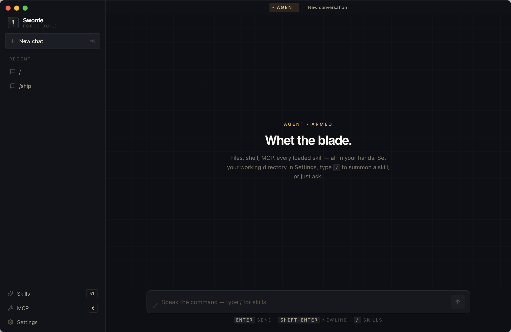

<div align="center">

# Sworde

**Open-source desktop client for Claude.**
Sign in with your Claude subscription. Your data stays local.

[](https://opensource.org/licenses/MIT)
[](https://www.electronjs.org/)
[](https://react.dev/)
[](https://www.typescriptlang.org/)
[](https://github.com/adityaswaroop823/sworde/pulls)

<br />



</div>

---

Sworde is a native desktop client for Anthropic's Claude, built on the official
[Claude Agent SDK](https://docs.anthropic.com/claude/docs/claude-agent-sdk).
It uses the same authentication as Claude Code — if you've run `claude login`
once, Sworde just works with your existing Pro / Max subscription. No extra
billing, no API key paste.

A pay-per-use API key is also supported as a fallback.

## Features

- **Sign in with your Claude subscription** — auto-detects your `claude login` session
- **API key fallback** — paste once, stored locally, never transmitted anywhere except Anthropic
- **Streaming responses** with markdown + Shiki syntax highlighting
- **Multi-chat sidebar** with searchable conversation history
- **Tool-use rendering** for Read / Edit / Bash / Grep / Glob (inline cards)
- **MCP server support** — bring your own tools
- **Subagents, hooks, plan mode** — everything the Agent SDK supports
- **Image and PDF input**, web fetch / search
- **Auto-compaction** for long sessions
- **100% local** — credentials, conversations, and config never leave your device

## Getting started

### Prerequisites

- **Node.js 18+** — [download](https://nodejs.org/)
- **One of:**
  - An active `claude login` session ([install Claude Code](https://docs.anthropic.com/claude/docs/claude-code) and run `claude login`), or
  - An [Anthropic API key](https://console.anthropic.com/settings/keys)

### Option 1 — Pre-built installer (easiest)

Grab the right installer for your OS from the
[Releases](https://github.com/adityaswaroop823/sworde/releases) page:

| Platform | File |
| --- | --- |
| macOS    | `Sworde-x.y.z.dmg` — open and drag into Applications |
| Windows  | `Sworde-Setup-x.y.z.exe` — run the installer |
| Linux    | `Sworde-x.y.z.AppImage` — `chmod +x` then double-click |

### Option 2 — Build from source

```bash
# 1. Clone the repo
git clone https://github.com/adityaswaroop823/sworde.git
cd sworde

# 2. Install dependencies
npm install

# 3. Run in dev mode (hot-reload)
npm run dev
```

To produce a distributable installer:

```bash
npm run build:mac     # .dmg → release/
npm run build:win     # NSIS installer → release/
npm run build:linux   # AppImage → release/
```

### First launch

On startup, Sworde probes for credentials in this order:

1. **Existing `claude login` session** → uses your Claude Pro / Max subscription. Done.
2. **Saved API key** → uses pay-per-use Anthropic API.
3. **Neither** → onboarding screen with two buttons:
   - **Sign in with Claude** — opens Terminal so you can run `claude login`, then click *"Recheck — I just signed in"*
   - **Use an API key** — paste once, stored locally on your device

Once authenticated, just type. Press `/` to open the slash palette, drag files
into the chat, and tool-permission prompts will surface inline as needed.

> **Tip:** set your working directory in **Settings** — Sworde will use it as
> the cwd for any file/shell tools the agent runs.

## Tech stack

- [Electron](https://www.electronjs.org/) + [electron-vite](https://electron-vite.org/)
- [React 18](https://react.dev/) + [TypeScript](https://www.typescriptlang.org/)
- [Tailwind CSS](https://tailwindcss.com/)
- [`@anthropic-ai/claude-agent-sdk`](https://www.npmjs.com/package/@anthropic-ai/claude-agent-sdk)
- [`electron-store`](https://github.com/sindresorhus/electron-store) for local config
- [Shiki](https://shiki.style/) for syntax highlighting

## Contributing

Contributions are welcome. Open an [issue](https://github.com/adityaswaroop823/sworde/issues)
to discuss bigger changes first; small fixes can go straight to a PR.

```bash
git clone https://github.com/adityaswaroop823/sworde.git
cd sworde
npm install
npm run dev
```

Make sure `npm run typecheck` passes before pushing.

## Disclaimer

Sworde is not affiliated with, endorsed by, or supported by Anthropic.

The project uses your existing Claude Code credentials via the official Claude
Agent SDK as a runtime dependency, the same way any other third-party tool
would. The Agent SDK is proprietary and governed by
[Anthropic's Commercial Terms](https://www.anthropic.com/legal/commercial-terms).

## License

[MIT](LICENSE) © Aditya Swaroop
